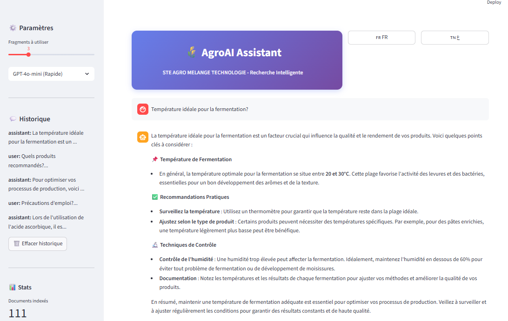
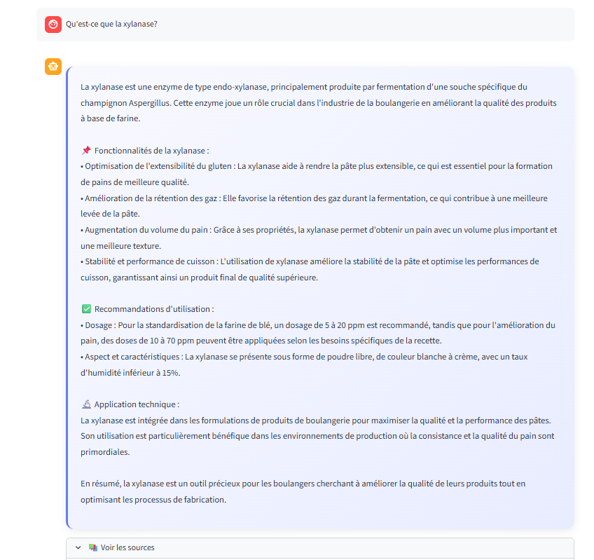
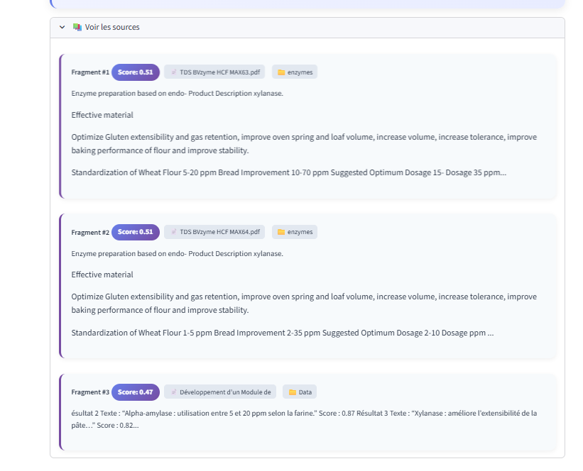
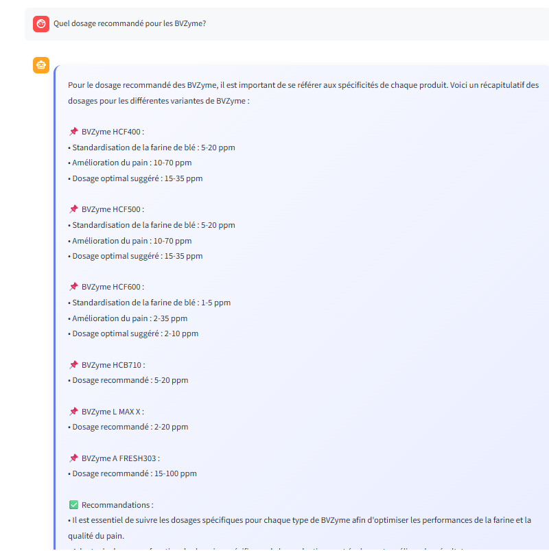
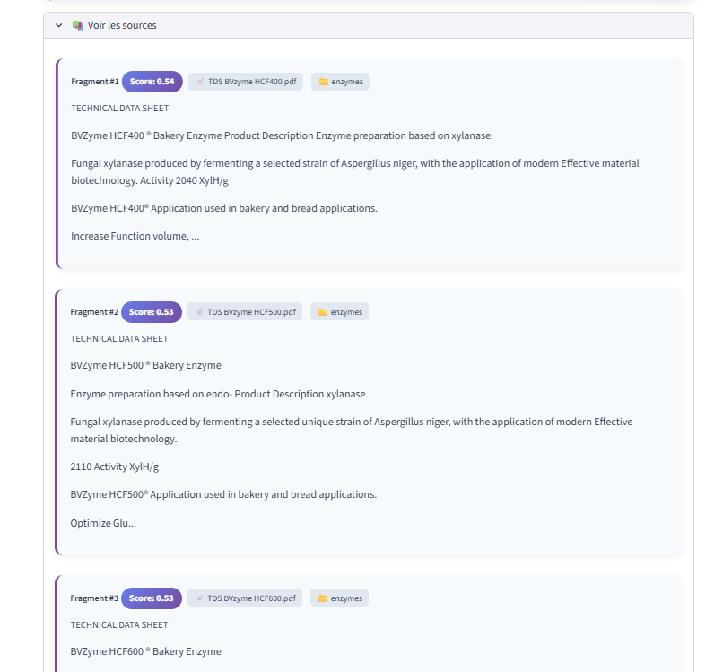
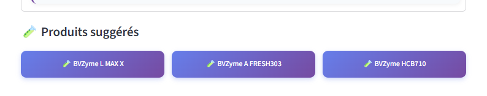
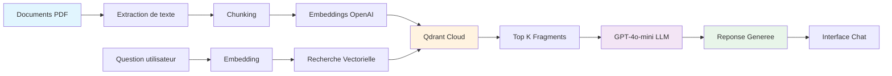

# AgroAI Assistant - Recherche Sémantique Intelligent

## Projet pour STE AGRO MELANGE TECHNOLOGIE - ROSE BLANCHE Group

---

## Overview

Ce projet propose un module de recherche sémantique utilisant la technologie RAG (Retrieval-Augmented Generation) permettant d'interroger une base documentaire technique en langage naturel. Le systeme combine la recherche vectorielle avec l'intelligence artificielle generative pour fournir des reponses precises et contextuelles.

---

## Probleme

Dans un contexte ou une base documentaire contient un grand volume d'informations techniques (fiches techniques, procedures, recommandations, cas d'usage), les utilisateurs rencontrent des difficultes a identifier rapidement les passages reels pertinents pour repondre a leur question.

---

## Solution

Un systeme intelligent capable d'assister l'utilisateur en retrouvant automatiquement les fragments les plus pertinents a partir d'une question formulee en langage naturel, puis de generer une reponse coherente citee.

---

## Interface de l'application



---

## Demonstration

### Exemple 1: Question sur la xylanase

**Question**: Qu'est-ce que la xylanase?



### Affichage des sources



---

### Exemple 2: Question sur le dosage

**Question**: Quel dosage recommande pour les BVZyme?



### Sources expandees



### Produits suggères



---

## Architecture



---

## Fonctionnalites

### Core Features
- Extraction automatique de texte depuis les fichiers PDF
- Decoupage intelligent du contenu en fragments (chunking)
- Generation d'embeddings semantiques via OpenAI
- Stockage vectoriel dans Qdrant Cloud
- Recherche par similarite cosinus
- Generation de reponses avec GPT-4o-mini
- Affichage des sources et scores de pertinence

### Advanced Features
- Conversation avec memoire contextuelle
- Suggestions de questions de suivi automatiques
- Recommandations de produits BVZyme
- Interface chat moderne et intuitive
- Support multilingue (Francais, Arabe)

---

## Installation

### Prerequis

- Python 3.9+
- Cle API OpenAI
- Compte Qdrant Cloud (ou stockage local)

### Configuration

1. Cloner le projet
2. Installer les dependances:

```bash
pip install -r requirements.txt
```

3. Configurer le fichier `.env`:

```bash
OPENAI_API_KEY=votre_cle_api_ici
QDRANT_URL=votre_url_qdrant
QDRANT_API_KEY=votre_cle_qdrant
```

---

## Utilisation

### 1. Ingestion des documents

```bash
python qdrant_ingest.py
```

Cette commande:
- Parcourt tous les fichiers PDF dans le dossier `Data/`
- Extrait le texte de chaque document
- Decoupe le contenu en fragments
- Genere les embeddings via OpenAI
- Stocke les vecteurs dans Qdrant Cloud

### 2. Lancer l'application

```bash
streamlit run simple_app.py
```

L'interface est accessible sur `http://localhost:8501`

### 3. Utiliser l'assistant

- Poser une question en langage naturel
- Le systeme recherche les fragments pertinents
- L'IA genere une reponse structuree
- Les sources sont affichees pour verification
- Des questions de suivi sont suggerees

---

## Structure du Projet

```
rag-night-challenge/
├── .env                     # Configuration (cles API)
├── requirements.txt         # Dependances Python
├── qdrant_ingest.py        # Pipeline d'ingestion des donnees
├── qdrant_query.py         # Moteur de recherche semantique
├── simple_app.py          # Interface Streamlit
├── Data/                  # Dossiers contenant les PDFs
│   ├── enzymes/           # Fiches techniques enzymes
│   └── ...
├── images/                # Captures d'ecran de l'application
└── README.md              # Documentation
```

---

## Stack Technique

- **Backend**: Python 3.9+
- **Extraction PDF**: pypdf
- **Embeddings**: OpenAI text-embedding-3-small
- **Vector Database**: Qdrant Cloud
- **LLM**: GPT-4o-mini
- **Interface**: Streamlit
- **Stockage**: Qdrant Cloud + fallback local

---

## Specifications Techniques

### Chunking
- Taille des fragments: 1000 caracteres
- Chevauchement: 100 caracteres
- Methode: Decoupage par caracteres avec preservation du contexte

### Embeddings
- Modele: OpenAI text-embedding-3-small
- Dimension: 1536
- Similarite: Cosinus

### Recherche
- Methode: Recherche vectorielle par similarite cosinus
- Resultats: Top 3 fragments les plus pertinents
- Seuil de score: Configurable

### Generation de Reponses
- Modele: GPT-4o-mini
- Temperature: 0.4 (equilibre creativite/precision)
- Tokens max: 800
- Contexte: Derniers 4 echanges de la conversation

---

## Resultats

Pour chaque question utilisateur, le systeme fournit:
1. Une reponse generee par l'IA, structuree et comprehensible
2. Les fragments sources utilises pour generer la reponse
3. Les scores de similarite indiquant la pertinence de chaque source
4. Les documents d'origine pour verification
5. Des suggestions de questions de suivi

---

## Innovations

1. **Conversation Contextuelle**: Le systeme se souvient des echanges precedents pour des reponses plus pertinentes

2. **Suggestions Intelligentes**: Gener automatiquement des questions de suivi basees sur le contexte

3. **Recommandations de Produits**: Suggere des produits specifiques (BVZyme) en fonction de la requete

4. **Interface Chat Moderne**: Experience utilisateur intuitive similaire a ChatGPT

5. **Transparence**: Affiche clairement les sources et scores de confiance

---

## Cas d'Usage

- Techniciens cherchant des informations sur les dosages enzymes
- Chercheurs et formulateurs etudiant les proprietes des ingredients
- Equipes commerciales needing rapid product information
- Formation des nouveaux employes sur les produits

---

## Avantages

- **Gain de temps**: Recherche instantanee au lieu de parcourir des PDFs
- **Precision**: Recherche semantique pas juste par mots-cles
- **Accessibilite**: Questions en langage naturel
- **Fiabilite**: Sources toujours citees pour verification
- **Scalabilite**: Facile d'ajouter de nouveaux documents

---

## Perspectives

- Integration avec d'autres bases de donnees de l'entreprise
- Support de documents multilingues
- Mode hors-ligne pour les utilisateurs terrain
- API REST pour integration avec d'autres systemes
- Interface mobile

